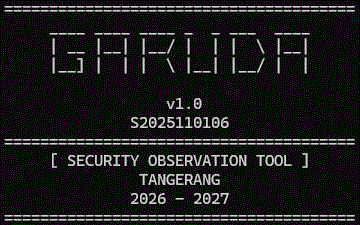

# GARUDA

Garuda is a high-performance, multithreaded network discovery platform engineered for cross-platform compatibility. By leveraging direct .NET APIs to bypass PowerShell runtime overhead, it delivers rapid, memory-efficient TCP port scanning on Windows, Linux, and macOS without requiring elevated privileges.

## Lean Development Principles
We minimize waste to keep Garuda fast, lightweight, and reliable:
- **Transportation**: Efficient data flow; passing references instead of duplicating objects.
- **Inventory**: Lean codebase; minimizing dependencies and removing unused modules.
- **Motion**: Direct execution; using native .NET APIs to bypass abstraction overhead.
- **Waiting**: Asynchronous I/O; maximizing throughput by eliminating blocking operations.
- **Over Processing**: High-efficiency code; avoiding unnecessary wrapper cmdlets.
- **Over Production**: Essentialism; building only what is strictly necessary.
- **Defect**: Quality assurance; ensuring consistent, bug-free cross-platform execution.
