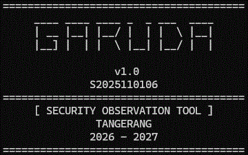

# GARUDA




Garuda is a high-performance, multithreaded network discovery platform engineered for cross-platform compatibility. By bypassing high-level abstractions in favor of direct socket-level primitives, Garuda minimizes runtime overhead and optimizes transport-layer interaction, delivering rapid, memory-efficient scanning across Windows, Linux, and macOS.

## Lean Development Principles
We ruthlessly eliminate waste to keep Garuda fast, lightweight, and rock-solid reliable. Rather than blindly adhering to a single execution model, we dynamically deploy the optimal tool—Synchronous or Asynchronous, Serial, Concurrent, or Parallel—tailored precisely to what each task requires:
- **Transportation**: Efficient data flow; passing object references instead of cloning data across execution and thread boundaries.
- **Inventory**: Lean codebase; minimal external dependencies with zero redundant modules or unused features.
- **Motion**: Direct execution via native .NET APIs to minimize unnecessary CPU context-switching and abstraction overhead.
- **Waiting**: Smart scheduling; utilizing Asynchronous non-blocking I/O for heavy tasks, yet safely pivoting to Synchronous execution when micro-tasks render async overhead wasteful.
- **Over Processing**: Tailored compute strategies; distributing workloads via multi-core Parallel execution for heavy computations, while enforcing strict Serial or Concurrent pipelines when absolute data consistency is mandatory.
- **Over Production**: Pure essentialism; building strictly what is necessary, completely eliminating architectural gold-plating and feature creep.
- **Defect**: Leak-free engineering; preventing race conditions and memory leaks by enforcing strict thread-safety and rigorous lifecycle management (Dispose) across all deployed execution models.

## Quick Start
1. Install PowerShell 7:
   - **Windows**:
     ```cmd
     winget install --id Microsoft.Powershell --source winget
     ```
   - **Linux**:
     ```bash
     sudo apt update && sudo apt install snapd
     sudo snap install powershell --classic
     ```
   - **macOS**:
     ```bash
     /bin/bash -c "$(curl -fsSL https://raw.githubusercontent.com/Homebrew/install/HEAD/install.sh)"
     brew install --cask powershell
     ```
2. Launch PowerShell 7:
   ```bash
   pwsh
   ```
3. Clone repository:
   ```bash
   git clone https://github.com/jokourno12/garuda
   ```
4. Navigate to the repository directory:
   ```bash
   cd garuda
   ```
5. Display the help information:
   ```bash
   .\src\index.ps1 -help
   ```
